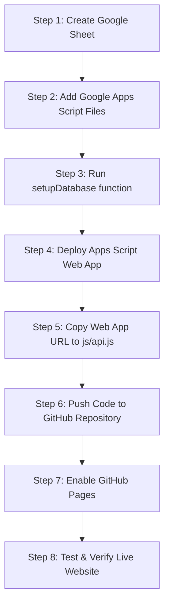

# 🚀 Complete Deployment Guide — "My Python Journey"

This document provides a step-by-step guide to deploying the entire **My Python Journey** platform from scratch.

---

## 🏗️ Architecture Overview

The system is built on a **100% free-tier, serverless architecture**:

```
 ┌────────────────────────────────────────────────────────┐
 │                    STATIC FRONTEND                     │
 │              Hosted on GitHub Pages (Free)             │
 │         HTML5 · CSS3 · Vanilla JavaScript (ES6)        │
 └───────────────────────────┬────────────────────────────┘
                             │
                  HTTPS POST │ (JSON Payload)
                             ▼
 ┌────────────────────────────────────────────────────────┐
 │                   SERVERLESS BACKEND                   │
 │           Google Apps Script Web App (Free)            │
 │           Authentication · Router · API Logic          │
 └───────────────────────────┬────────────────────────────┘
                             │
                             ▼
 ┌────────────────────────────────────────────────────────┐
 │                   DATABASE STORAGE                     │
 │                 Google Sheets (Free)                   │
 │          15 Sheets (Users, Chapters, Quizzes...)       │
 └────────────────────────────────────────────────────────┘
```

* **No server maintenance**: No VPS, Node.js server, Docker container, or paid database needed.
* **Cost**: $0.00 / month forever.
* **Performance**: Fast static asset delivery via GitHub CDN + instant caching in Apps Script `CacheService`.

---

## 📋 Prerequisites

Before starting, ensure you have:
1. A **Google Account** (for Google Sheets & Google Apps Script).
2. A **GitHub Account** (for GitHub Pages static hosting).
3. Git installed on your computer (or use GitHub Web Upload).

---

## 📑 Step-by-Step Deployment



---

### Step 1: Create Google Sheet Database

1. Go to [Google Sheets](https://sheets.google.com).
2. Click **Blank spreadsheet** to create a new sheet.
3. Rename the sheet at the top left to:
   ```text
   Python Learning Journey Database
   ```
4. You do **not** need to manually create the 15 tabs or column headers; our automated script in Step 3 will build and format them automatically.

---

### Step 2: Add Google Apps Script Files

1. In your newly created Google Sheet, click **Extensions** → **Apps Script** in the top menu.
2. In the Apps Script editor:
   * Rename the project in the top left from *Untitled project* to `Python-Journey-Backend`.
   * Open the default `Code.gs` file, delete any existing code, and replace it with the code from:
     * `google-apps-script/Code.gs`
3. Create the remaining script files:
   * Click **+ (Add a file)** → **Script**
   * Name each file and paste the corresponding code from the `google-apps-script/` directory:

| Apps Script Filename | Source File in Repository |
| :--- | :--- |
| `Auth` | `google-apps-script/Auth.gs` |
| `Chapters` | `google-apps-script/Chapters.gs` |
| `Progress` | `google-apps-script/Progress.gs` |
| `Quiz` | `google-apps-script/Quiz.gs` |
| `Stats` | `google-apps-script/Stats.gs` |
| `DatabaseSetup` | `google-apps-script/DatabaseSetup.gs` |

4. Click **Save all files** (💾 icon or `Ctrl + S`).

> [!TIP]
> In `google-apps-script/Code.gs`, you can customize `PASSWORD_SALT` to your own private string (e.g. `'my_secure_python_salt_2026'`) for additional security.

---

### Step 3: Run `setupDatabase()`

1. In the Apps Script toolbar, locate the function dropdown menu (it may say `doPost` or `myFunction`).
2. Select **`setupDatabase`** from the list.
3. Click **▶ Run**.
4. **Google Authorization Prompt**:
   * Google will ask for permission to access your Google Sheet.
   * Click **Review Permissions** → Choose your Google account.
   * Click **Advanced** (bottom left) → Click **Go to Python-Journey-Backend (unsafe)**.
   * Click **Allow**.
5. Wait a few seconds until the execution log shows:
   ```text
   Execution completed
   ```
6. Return to your Google Sheet tab. You will see that **all 15 sheets** (`users`, `chapters`, `sections`, `content`, `quizzes`, `quiz_questions`, `quiz_options`, `progress`, `bookmarks`, `notes`, `questions`, `question_answers`, `quiz_attempts`, `activity_logs`, `settings`) have been created, formatted, and populated with demo data!

---

### Step 4: Deploy Apps Script as a Web App

1. In the top right corner of the Apps Script editor, click **Deploy** → **New deployment**.
2. Click the **⚙️ Gear icon** (Select type) next to "Select type" and select **Web app**.
3. Fill in the deployment details:
   * **Description**: `Production Web App v1`
   * **Execute as**: **Me (your_email@gmail.com)**
   * **Who has access**: **Anyone** *(Essential so frontend fetch requests can reach the backend)*
4. Click **Deploy**.
5. **Copy the Web App URL**:
   * It will look like:
     ```text
     https://script.google.com/macros/s/AKfycbx1234567890abcdefghijklmnopqrstuvwxyz/exec
     ```
   * Save this URL for the next step.

---

### Step 5: Configure Frontend API Endpoint

1. In your project codebase, open `js/api.js`.
2. Locate line 6 (`API_URL`):
   ```javascript
   const CONFIG = window.CONFIG || {
       // Paste your deployed Google Apps Script Web App URL here
       API_URL: 'https://script.google.com/macros/s/YOUR_DEPLOYMENT_ID/exec',
       DEFAULT_PASS_MARK: 70,
       SESSION_KEY: 'pythonJourneySession',
       LANGUAGE_KEY: 'pythonJourneyLanguage',
       MOCK_DB_KEY: 'pythonJourneyMockDB'
   };
   ```
3. Replace the placeholder URL with your actual Apps Script Web App URL from Step 4.
4. Save the file.

---

### Step 6: Deploy Frontend to GitHub Pages

#### Method A: Using Git CLI (Recommended)

1. Open your terminal in the project directory:
   ```bash
   cd /path/to/my-learning-journey-prototype
   ```

2. Initialize git repository:
   ```bash
   git init
   git add .
   git commit -m "Deploy production Python Learning Journey"
   ```

3. Create a new repository on GitHub:
   * Go to [github.com/new](https://github.com/new).
   * Name it: `my-learning-journey` (or any name you prefer).
   * Choose **Public**.
   * Click **Create repository**.

4. Push your code to GitHub:
   ```bash
   git remote add origin https://github.com/YOUR_GITHUB_USERNAME/my-learning-journey.git
   git branch -M main
   git push -u origin main
   ```

#### Method B: Using GitHub Web UI
1. Create a new public repository on GitHub.
2. Click **Upload files** and drag the entire project folder contents into the browser.
3. Commit the changes to the `main` branch.

---

### Step 7: Enable GitHub Pages

1. In your GitHub repository, click **Settings** tab.
2. In the left sidebar, click **Pages** (under the "Code and automation" section).
3. Under **Build and deployment**:
   * **Source**: Select `Deploy from a branch`.
   * **Branch**: Select `main`, and folder `/ (root)`.
4. Click **Save**.
5. After 30–60 seconds, GitHub will display your live website URL:
   ```text
   https://YOUR_GITHUB_USERNAME.github.io/my-learning-journey/
   ```

---

## 🧪 Step 8: Verification & Testing Checklist

Open your live GitHub Pages URL and perform the following test sequence:

- [ ] **Landing Page**:
  * Check that `index.html` loads cleanly with the dark theme.
  * Click the **EN / বাংলা** toggle in the top right to verify bilingual translation.
  * Click **"Read the Journey"** to navigate to `login.html`.
- [ ] **Admin Login**:
  * Log in with `username: admin` and `password: admin123`.
  * Confirm you are redirected to `admin/index.html`.
  * Verify that system statistics (Users, Chapters, Quizzes) appear correctly.
  * Check the **Users** tab and test creating a new user account.
- [ ] **Learner Login & Chapter Progression**:
  * Log in with `username: reza` and `password: demo123`.
  * Confirm you are redirected to `dashboard.html`.
  * Click **"Continue Reading →"** to open `reader.html`.
  * Verify that Python code blocks display properly and that **"Copy Code"** works.
  * Test adding a private note and a bookmark.
  * Click **"Take Chapter Quiz →"** at the bottom of Chapter 1.
  * Complete the quiz with $\ge 70\%$ score and verify that Chapter 2 unlocks!

---

## 🔄 Making Future Updates

### Updating Learning Content or Quizzes:
You can manage everything directly through the live **Admin Control Panel** (`admin/index.html`) without re-deploying code! Changes are saved directly to Google Sheets in real time.

### Updating Frontend HTML / CSS / JS:
1. Make changes locally.
2. Commit and push to GitHub:
   ```bash
   git add .
   git commit -m "Update frontend features"
   git push origin main
   ```
3. GitHub Pages will automatically update within 1 minute.

### Updating Google Apps Script Backend:
1. Make changes in the Apps Script editor.
2. Click **Deploy** → **Manage deployments**.
3. Click the **✏️ Edit icon** next to your active deployment.
4. Set **Version** to **New version**.
5. Click **Deploy**. *(The Web App URL remains the same!)*

---

## 🛡️ Production Security Best Practices

1. **Change Default Passwords**: Immediately log in as `admin` and change the admin password through the Profile modal or user management table.
2. **Do Not Make Google Sheet Public**: Keep your Google Sheet sharing setting as **Restricted / Private**. Only your Google account needs access; Apps Script securely connects to it.
3. **Change Password Salt**: Update `PASSWORD_SALT` in `Code.gs` prior to creating student accounts.
4. **Regular Backups**: Make periodic copies of your Google Sheet via **File → Make a copy**.

---

**Your project is now 100% production ready and live! 🚀**
